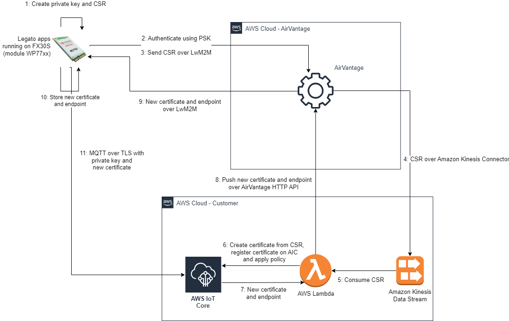

# Zero touch provisioning solution

Semtech ZTP solution is built based on leveraging the existing trust relationship between the HRoT found inside Sierra’s modules and AirVantage platform to automate the provision of the device using that module into the customer’s AWS account IoT Core service.

The PoC has been implemented around an FX30S Gateway from Sierra that uses an WP77 module. This module is able to run applications built using the Legato framework that includes the ability to securely connect and authenticate (based on pre-shared-keys) with AirVantage.

The following architecture diagram describes, at high level, the ZTP solution:



The implementation of this ZTP solution is done around two Legato applications (ZTP and MQTT client apps) running on the device. 

The ZTP app takes care of creating a CSR (based on a private key that always remains on the device) that is send over a secure/authenticated channel to AirVantage in order to reach the customer’s AWS account using a Kinesis Stream (existing AirVantage connector). Once on the customer’s AWS account, a helper Lambda functions reads from the Kinesis Stream and process the CSR input by invoking the AWS IoT Core API to create a new certificate from the incoming CSR, apply a policy to it and return the PEM file (and IoT Core endpoint) back to AirVantage using the HTTP API exposed by AirVantage. Finally, AirVantage relies that PEM file back to application running on the device (after a fragmentation process) where the data is de-fragmented and stored in the device for later use.

The MQTT client app is then ready to use the private key and certificate to establish an MQTT over mTLS connection towards the end customer’s AWS IoT Core endpoint to start publishing data directly into IoT Core.

The following instructions (detailed in the specific order) can be followed in order to setup and test the ZTP solution.

## Pre-requisites

As a pre-condition to testing this solution, you need to have your device registered on your AirVantage account, for details on how to do it, please refer to [Register - av - Sierra Wireless (airvantage.net)](https://doc.airvantage.net/av/reference/register/).

## 1. Setup Legato dev env

Once you have your system registered and connected to AirVantage, you can proceed to build the device’s applications detailed above. The building step requires having a dev environment for Legato as detailed in [Leaf Workspace Manager - Legato Docs](https://docs.legato.io/latest/confLeaf.html). 

In our specific env, we used the following settings/steps.

1. Create a new AWS Cloud9 env using Ubuntu Server 22.04 LTS and t3.small (2 GiB RAM + 2 vCPU) and extend storage to 20 Gb using script at https://docs.aws.amazon.com/cloud9/latest/user-guide/move-environment.html#move-environment-resize

2. Run the following commands to get Leaf and its dependencies installed 

    ```
    sudo apt update
    
    wget https://downloads.sierrawireless.com/tools/leaf/leaf_latest.deb -O /tmp/leaf_latest.deb && sudo apt install /tmp/leaf_latest.deb
    
    mkdir ~/myWorkspace; cd ~/myWorkspace; mkdir apps
    
    leaf search -t wp77xx -t latest -v
    
    leaf setup wp77stable -p swi-wp77_6.0.1
    
    sudo pip install Jinja2
    
    leaf profile sync wp77stable
    ```

## 2. Build and deploy the ZTP Legato app

In order to build and install the ZTP Legato app, follow the instructions below:

1. Create a new folder (ztp) under ~/myWorkspace/apps

2. Copy the contents of the Device/ztp folder within this repo to ~/myWorkspace/apps/ztp

3. Run the following commands to build the ZTP app within your Legato dev env

    ```
    cd ~/myWorkspace
    
    leaf shell
    
    cd apps/ztp
    
    make wp77xx
    
    av-pack -u ztp.wp77xx.update -b _build_ztp/wp77xx/ -t com.semtech.av.ztp
    ```

4. In order to proceed with the OTA installation of the app to your device, follow the below steps:

    1. Unzip the ZIP file produced above (ztp.zip) in order to modify the manifest file using the correct asset model
    
    2. Copy and paste the *capabilities* section from the semtech.ztp.model.app manifest file that you can find under the Model folder of this repo and make sure to preserve the binary section of the original as well as the correct release number

    3. Zip the modified manifest together with the binary file
    
    4. Release and publish app on AirVantage (AV/Develop/MyApps -> Release (check Publish in Advanced Settings)). Please refer to [AirVantage User Guide - Develop](https://doc.airvantage.net/av/reference/develop/) for reference
    
    5. Install app on System on AirVantage (AV/Monitor/System -> More/Install App). Please refer to [AirVantage User Guide - How to manage your device from AirVantage](https://doc.airvantage.net/av/howto/hardware/devMgt_howto/) for reference

## 3. Build and deploy the MQTT client Legato app

In order to build and install the MQTT client Legato app, follow the instructions below:

1. Create a new folder (awsMqtt) under ~/myWorkspace/apps

2. Copy the contents of the Device/awsMqtt folder within this repo to ~/myWorkspace/apps/awsMqtt (please note that this app is based on a modified subset of AWS IoT Device SDK for Embedded C from https://github.com/aws/aws-iot-device-sdk-embedded-C/ and its dependencies such as Mbed TLS)

3. Run the following commands to build the MQTT client app within your Legato dev env

    ```
    cd ~/myWorkspace
    
    leaf shell
    
    cd apps/awsMqtt
    
    make wp77xx
    
    av-pack -u awsMqtt.wp77xx.update -b _build_awsMqtt/wp77xx/ -t com.semtech.av.awsmqtt
    ```

4. In order to proceed with the OTA installation of the app to your device, follow the below steps:

    1. Release and publish app on AirVantage (AV/Develop/MyApps -> Release (check Publish in Advanced Settings)). Please refer to [AirVantage User Guide - Develop](https://doc.airvantage.net/av/reference/develop/) for reference
    
    2. Install app on System on AirVantage (AV/Monitor/System -> More/Install App). Please refer to [AirVantage User Guide - How to manage your device from AirVantage](https://doc.airvantage.net/av/howto/hardware/devMgt_howto/) for reference

## 4. Configure the Kinesis connector

To have the data flowing from AirVantage to AWS, you need to configure a Kinesis Stream connector within your AirVantage account. Please follow the instructions available at [How to use the Kinesis Connector - connectivity - Sierra Wireless (airvantage.net)](https://doc.airvantage.net/connectivity/howto/cloud/kinesis_howto/). 

## 5. Create and configure the Lambda function

Once you have the data flowing into your AWS account, you need to deploy the Lambda function that will handle the CSR coming from your device and perform the tasks required to create and register a certificate using the CSR within AWS IoT. Please refer to the instructions at [Using AWS Lambda with Amazon Kinesis - AWS Lambda](https://docs.aws.amazon.com/lambda/latest/dg/with-kinesis.html) and [AWS IoT Core policies](https://docs.aws.amazon.com/iot/latest/developerguide/iot-policies.html) for reference and specifically, follow the instructions detailed below:

1. Create IoT policy with name *ztp* and use the follow definition for it (please note this is a very relaxed policy only intended for demostration purpose, make sure you follow AWS's best practices for IoT policies definition in your production environment)

    ```
    {
      "Version": "2012-10-17",
      "Statement": [
        {
          "Effect": "Allow",
          "Action": "*",
          "Resource": "*"
        }
      ]
    }
    ```

2. Create Lambda function using Runtime -> Python 3.11 and Handler -> lambda_function.lambda_handler and copy and paste the code contained in the file Lambda/ztp.py inside this repo

3. Modify Lambda's role to include following actions:

    ```    
    "kinesis:DescribeStream",
    "kinesis:DescribeStreamSummary",
    "kinesis:GetRecords",
    "kinesis:GetShardIterator",
    "kinesis:ListShards",
    "kinesis:ListStreams",
    "kinesis:SubscribeToShard",
    "logs:CreateLogGroup",
    "logs:CreateLogStream",
    "logs:PutLogEvents",
    "iot:CreateCertificateFromCsr",
    "iot:AttachPolicy",
    "iot:DescribeEndpoint"
    ```

4. Associate the Kinesis stream created above as trigger for Lambda

5. Add the following env vars to Lambda

    1. client_id -> You need to create a new API Client in AirVantage following the instructions at https://doc.airvantage.net/av/reference/develop/howtos/newAPIClient/ and use the client id associated with it.
    
    2. client_secret -> You need to create a new API Client in AirVantage following the instructions at https://doc.airvantage.net/av/reference/develop/howtos/newAPIClient/ and use the client secret associated with it.
    
    3. password -> Your password used to access AirVantage
    
    4. username -> Your username used to access AirVantage

## 6. Test the solution end to end

Now, you should be ready to start the applications on the device. You will need to ssh into your device and use the Legato’s app command as detailed in [app - Legato Docs](https://docs.legato.io/latest/toolsTarget_app.html). Please note that you should first run the ZTP app (to create the credentials required to access AWS IoT Core) and then the MQTT client app. 

Once you have ssh into your device, you can use the below commands to start the apps and inspect the logs: 

```    
app start ztp && logread -f | grep ztp

app start awsMqtt && logread -f | grep awsMqtt
```    

In order to confirm that the MQTT client app is successfully connected to your AWS IoT Core endpoint, you should follow the instructions at [View MQTT messages with the AWS IoT MQTT client - AWS IoT Core (amazon.com)](https://docs.aws.amazon.com/iot/latest/developerguide/view-mqtt-messages.html).

